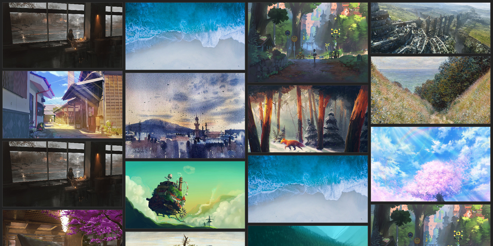

# Gallery

Gallery lets me host and view any collection(s) of images.
See the description for the repository.

## Uses
A simple web-app I use to help me do a few things:

* Host my many desktop backgrounds outside of my .files repository, so it
  doesn't get huge with hundreds of high-resolution images. This is hosted
  on a droplet.
* Run the server locally to serve all of my screenshots that I've taken.
  Doing this lets me find an old screenshot by image, instead of its filename,
  which only gives timestamp information.
* As a dependency for my bookshelf project; Gallery helps display my to-read
  bookshelf via their covers, so that I can identify them visually instead of
  just by their titles.

## Awkward things

There are some things I didn't bother to do because I personally didn't care for them too much. Some of them are things I will care about eventually and will do, others likely never.

* Gallery does not support nested directory structures. It will ignore
  nested directories and not walk them recursively looking for images.
* Non-image files are not detected or ignored, so they show up with a broken
  image icon. Kind of ugly, but all my use-cases never run into this so I don't really care.

---

### Here's a screenshot of Gallery, running against a subset of my wallpapers:

